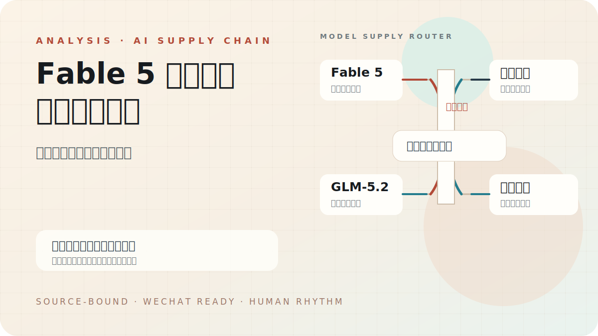
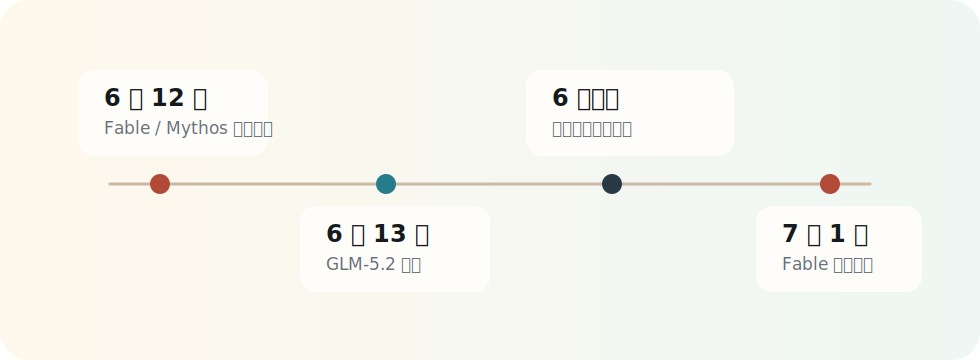

# Fable 5 被封禁，智谱冲万亿：模型采购进入双供应商时代

6 月 12 日，美国商务部把 Anthropic 的 Fable 5 和 Mythos 5 放进出口管制清单。

Anthropic 后来在官方说明里给出解释：命令立即生效，公司无法实时核验每个用户的国籍，于是先暂停两款模型对所有用户的访问。到 6 月 30 日，限制解除，Fable 5 从 7 月 1 日开始恢复全球使用。

这次暂停很短，信号很重。

我的判断是：Fable 5 事件把 AI 模型从“软件能力采购”推向了“供应链风险采购”。智谱获得的窗口，也来自这个变化。市场给它的溢价，买的是备用通道、开放权重和地缘风险下的可用性。

第二天，Z.ai，也就是原来的智谱，推出 GLM-5.2。官方博客和开发文档给出的卖点集中在三件事：1M 上下文、长任务与代码能力、MIT 开源许可。

随后，智谱的资本叙事迅速升温。36氪援引豹变的报道写到，智谱市值一度越过万亿港元门槛；SCMP 也把 Fable 5 暂停服务视为中国 AI 模型争取全球开发者的窗口。

这篇文章的立场很直接：智谱的机会成立，但万亿定价跑在了产品验证前面。企业真正应该学到的经验：别押注某一家模型公司，立刻建立多模型路由和第二供应商。

## 01 监管闸门一落，采购逻辑就变了

Fable 5 的暂停比普通宕机更值得警惕。

宕机考验服务恢复。出口管制改变长期预期。

对开发者来说，模型一旦进入生产链路，就会接入代码仓库、文档系统、内部工具、自动化流程和客户交付。模型供应突然中断，受影响的范围会从一次对话扩散到整条工作流。

很多企业过去把模型采购当成 API 选择题：谁更强、谁更便宜、谁延迟更低。Fable 5 之后，采购表格里要多出一列：这条能力能不能被政策、国别、合规边界突然切断。

这就是 GLM-5.2 被看见的窗口。

它发布在一个敏感时间点：开发者刚刚意识到，单一模型依赖会把业务暴露在不可控风险里。

## 02 智谱讲出的关键词是“可替换”

GLM-5.2 的关键卖点有三个。

第一，1M 上下文。官方文档强调它支持 1M lossless context，用来降低长任务里的上下文漂移和目标遗忘。

第二，开放权重。Z.ai 官方博客把 MIT 许可写成核心卖点，强调没有区域限制，也更容易被开发者接入和自部署。

第三，面向长任务和代码。GitHub 页面披露的榜单数据里，GLM-5.2 在 Terminal-Bench 2.1、SWE-bench Pro 等工程类任务上较前代有明显提升。

这些能力还需要生产环境继续验证。真正难的部分从来都在榜单之外：价格、延迟、稳定性、工具调用、上下文保真、企业支持、合规审计。

但在 Fable 5 暂停服务的窗口，智谱讲出的故事非常清楚：当主模型受限时，企业需要能部署、能替换、能接上的第二套能力。

## 03 万亿市值买的是风险溢价

智谱冲上万亿港元市值，不能只按模型能力解释。

更合理的拆法，是三层风险溢价。

第一层，地缘政治溢价。先进模型被纳入监管之后，非美国模型的“可选性”会变贵。

第二层，开放生态溢价。开放权重意味着开发者可以下载、微调、部署、接入，也可以把模型塞进自己的代理系统里。

第三层，本土替代溢价。中国资本市场熟悉“卡脖子替代”的定价逻辑，算力层出现过，模型层现在也开始出现。

这三层溢价可以解释短期热度，却不能自动变成长期护城河。

开源模型能换来开发者好感，也会把竞争拉到更残酷的位置。发布当天的热度留不住用户，文档、API、推理成本、生态工具、企业支持和连续迭代才会留住用户。

智谱拿到了窗口，还要把窗口变成账单。

## 04 企业要补的课：模型路由

Fable 5 事件给所有 AI 公司提了一个很现实的工程要求。

企业不能再把模型层写死在单一供应商上。

更稳的架构应该长这样：

- 高价值长任务走最强模型。
- 敏感或合规任务走可审计模型。
- 成本敏感任务走轻量模型。
- 主供应商不可用时，自动切到第二供应商。
- 核心流程保留本地或开源备份。

这套能力听起来像工程洁癖，接下来会变成生产常识。

对智谱来说，机会也在这里。它无需立刻证明自己全面超过 Fable 5。它要证明的是：在足够多的长任务、代码代理、企业自动化场景里，它能稳定接上生产链路。

## 05 这轮分水岭会留下什么

如果 Fable 5 只是一次短暂插曲，市场热度会退。

如果类似事件继续出现，AI 产业会进入新的采购逻辑：模型能力、供应安全、部署自由度一起定价。

这才是智谱万亿叙事背后的分水岭。

国产模型的机会来自两条线：一条是能力追赶，一条是全球开发者对单点依赖的恐惧。前者决定长期上限，后者决定短期窗口。

Anthropic 关上的那扇门已经重新打开。

但很多企业已经开始配第二把钥匙。

## Sources

- Anthropic, “Redeploying Claude Fable 5”, June 30, 2026: https://www.anthropic.com/news/redeploying-fable-5
- Z.ai, “GLM-5.2: Built for Long-Horizon Tasks”, June 2026: https://z.ai/blog/glm-5.2
- Z.ai Developer Docs, GLM-5.2 release note: https://docs.z.ai/release-notes/new-released
- Z.ai GitHub, GLM-5: https://github.com/zai-org/GLM-5
- 36氪 / 豹变, “从580亿到万亿市值，智谱的半年狂奔”, June 24, 2026: https://m.36kr.com/p/3867021077271557
- SCMP, “How Anthropic’s Fable 5 shutdown could help China’s Zhipu GLM-5.2 gain ground”, June 23, 2026: https://www.scmp.com/tech/article/3358067/how-anthropics-fable-5-shutdown-could-help-chinas-zhipu-glm-52-gain-ground
